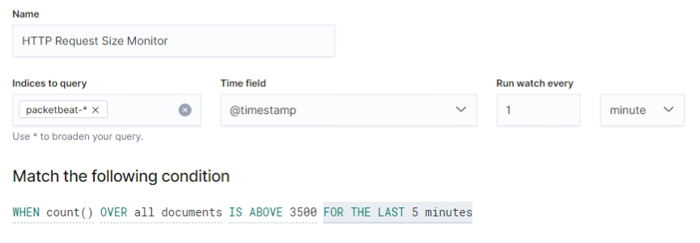
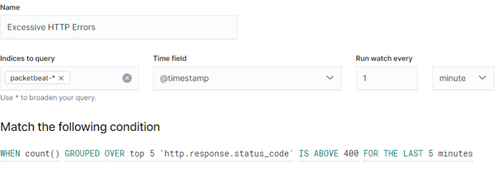
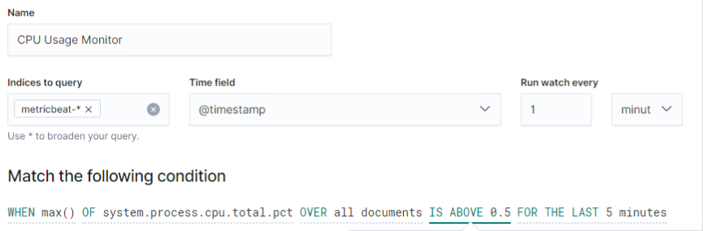
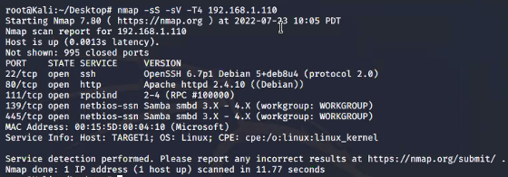

#Final Project 

Network Toplogy

Alerts Created

Thresholds Set

# Blue Team: Summary of Operations

Table of Contents

Network Topology
Description of Targets
Monitoring the Targets
Patterns of Traffic & Behavior
Suggestions for Going Further

Network Topology
TODO: Fill out the information below.
The following machines were identified on the network:

Name of VM 1
Kali
Operating System:
Linux
Purpose:
Attack Machine
IP Address:
192.168.1.90

Name of VM 2
Capstone
Operating System:
Linux
Purpose:
Test Machine
IP Address:
192.168.1.105

Etc.

Description of Targets
TODO: Answer the questions below.
The target of this attack was: Target 1 (TODO: IP Address).
Target 1 is an Apache web server and has SSH enabled, so ports 80 and 22 are possible ports of entry for attackers. As such, the following alerts have been implemented:

Monitoring the Targets
Traffic to these services should be carefully monitored. To this end, we have implemented the alerts below:

Name of Alert 1
TODO: Replace Alert 1 with the name of the alert.
Alert 1 is implemented as follows:

Metric: TODO

Threshold: TODO

Vulnerability Mitigated: TODO

Reliability: TODO: Does this alert generate lots of false positives/false negatives? Rate as low, medium, or high reliability.

Name of Alert 2
Alert 2 is implemented as follows:

Metric: TODO

Threshold: TODO

Vulnerability Mitigated: TODO

Reliability: TODO: Does this alert generate lots of false positives/false negatives? Rate as low, medium, or high reliability.

Name of Alert 3
Alert 3 is implemented as follows:

Metric: TODO

Threshold: TODO

Vulnerability Mitigated: TODO

Reliability: TODO: Does this alert generate lots of false positives/false negatives? Rate as low, medium, or high reliability.

TODO Note: Explain at least 3 alerts. Add more if time allows.

Suggestions for Going Further (Optional)
TODO:

Each alert above pertains to a specific vulnerability/exploit. Recall that alerts only detect malicious behavior, but do not stop it. For each vulnerability/exploit identified by the alerts above, suggest a patch. E.g., implementing a blocklist is an effective tactic against brute-force attacks. It is not necessary to explain how to implement each patch.

The logs and alerts generated during the assessment suggest that this network is susceptible to several active threats, identified by the alerts above. In addition to watching for occurrences of such threats, the network should be hardened against them. The Blue Team suggests that IT implement the fixes below to protect the network:

Vulnerability 1

Patch: TODO: E.g., install special-security-package with apt-get

Why It Works: TODO: E.g., special-security-package scans the system for viruses every day

Vulnerability 2

Patch: TODO: E.g., install special-security-package with apt-get

Why It Works: TODO: E.g., special-security-package scans the system for viruses every day

Vulnerability 3

Patch: TODO: E.g., install special-security-package with apt-get

Why It Works: TODO: E.g., special-security-package scans the system for viruses every day

# Red Team: Summary of Operations

Table of Contents

Exposed Services
Critical Vulnerabilities
Exploitation

Exposed Services
TODO: Fill out the information below.
Nmap scan results for each machine reveal the below services and OS details:

$ nmap -sS -sV -T4 192.168.1.110 

This scan identifies the services below as potential points of entry:

Target 1
| Port   | Open Service   | Version   |
| ------ | -------------- | --------- |
| 22/tcp | ssh            | OpenSSH 6.7p1 Debian 5+deb8u4 |
| 80/tcp | http           | Apache httpd 2.4.10 ((Debian)) |  

TODO: Fill out the list below. Include severity, and CVE numbers, if possible.
The following vulnerabilities were identified on each target:

Target 1

List of
Critical
Vulnerabilities

TODO: Include vulnerability scan results to prove the identified vulnerabilities.

Exploitation
TODO: Fill out the details below. Include screenshots where possible.
The Red Team was able to penetrate Target 1 and retrieve the following confidential data:

Target 1

flag1.txt: TODO: Insert flag1.txt hash value

Exploit Used

TODO: Identify the exploit used
TODO: Include the command run

flag2.txt: TODO: Insert flag2.txt hash value

Exploit Used

TODO: Identify the exploit used
TODO: Include the command run
