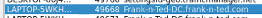

Network Analysis
Time Thieves
At least two users on the network have been wasting time on YouTube. Usually, IT wouldn't pay much mind to this behavior, but it seems these people have created their own web server on the corporate network. So far, Security knows the following about these time thieves:
They have set up an Active Directory network.
They are constantly watching videos on YouTube.
Their IP addresses are somewhere in the range 10.6.12.0/24.
You must inspect your traffic capture to answer the following questions:
What is the domain name of the users' custom site?

10.6.12.157 DC.Frank-n-Ted.com
10.6.12.203

 
What is the IP address of the Domain Controller (DC) of the AD network?
 
What is the name of the malware downloaded to the 10.6.12.203 machine? Once you have found the file, export it to your Kali machine's desktop.
 
Upload the file to VirusTotal.com. What kind of malware is this classified as?
 
 
 
Vulnerable Windows Machines
The Security team received reports of an infected Windows host on the network. They know the following:
Machines in the network live in the range 172.16.4.0/24.
The domain mind-hammer.net is associated with the infected computer.
The DC for this network lives at 172.16.4.4 and is named Mind-Hammer-DC.
The network has standard gateway and broadcast addresses.
Inspect your traffic to answer the following questions:
Find the following information about the infected Windows machine:
Host name:
IP address:
MAC address:

What is the username of the Windows user whose computer is infected?
 
What are the IP addresses used in the actual infection traffic?
 
As a bonus, retrieve the desktop background of the Windows host.
 
