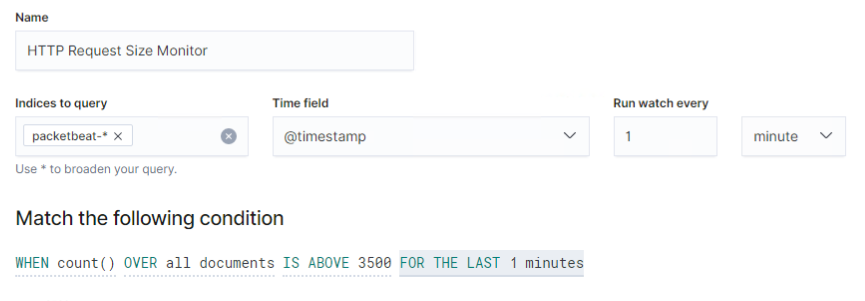

# Final Project 

Network Toplogy


## Final Engagement Presentation
https://docs.google.com/presentation/d/1hmPu8SV9_WRHx5UDpe2E-sTZErQinqoywqXFH4lqOPc/edit#slide=id.g136e1d8cf17_4_18

## Blue Team: Summary of Operations

Table of Contents

Network Topology
Description of Targets
Monitoring the Targets
Patterns of Traffic & Behavior
Suggestions for Going Further


Network Topology
The following machines were identified on the network:

### Name of VM 1
`Kali`

Operating System:
`Linux`

Purpose:
`Attack Machine`

IP Address:
`192.168.1.90`

### Name of VM 2
`Capstone`

Operating System:
`Linux`

Purpose:
`Test Machine`

IP Address:
`192.168.1.105`

Etc.


Description of Targets
Answer the questions below.

The target of this attack was: 
Target 1 (`192.168.1.110`). Target 1 is an Apache web server and has SSH enabled, so ports 80 and 22 are possible ports of entry for attackers. 

As such, the following alerts have been implemented:




-------

### Monitoring the Targets
Traffic to these services should be carefully monitored. To this end, we have implemented the alerts below:

-  `HTTP Request Size Monitor` is implemented as follows:

        Metric: `All HTTP documents`

        Threshold: `3500 requests per 1 minutes `

        Vulnerability Mitigated: `Repeat request byte sizes, mitigating scans that happen quicker that human capabilities to reduce risk of sensitive data exposure.`

        Reliability: `Low; Possibility for false positives/false negatives. This threshold is low and would alert very often.`


- `Excessive HTTP Errors`is implemented as follows:

        Metric: `http.response.status_code`

        Threshold: `400 errors per 5 minutes`

        Vulnerability Mitigated: `Ports scans used to map out which are open or closed to reduce server-side request forgery.`

        Reliability: `Medium/High; Low possibility for false positives/false negatives. Since there are limited ports open on the server to trigger the alert, there would be many accurate alerts.`

- `CPU Usage Monitor` is implemented as follows:

        Metric: `system.process.cpu.total.pct`

        Threshold: `.5`

        Vulnerability Mitigated: `Resource exhaustion to avoid risk of DoS attack.`

        Reliability: `Low; Possibility for false positives/false negatives. CPU usage can ramp up for a multitude of reasons, including updates or high usage software.`

----

## Red Team: Summary of Operations

Table of Contents

Exposed Services
Critical Vulnerabilities
Exploitation


Exposed Services
Nmap scan results for each machine reveal the below services and OS details:

$ nmap -sS -sV -T4 192.168.1.110 


This scan identifies the services below as potential points of entry:

Target 1
| Port   | Open Service   | Version   |
| ------ | -------------- | --------- |
| 22/tcp | ssh            | OpenSSH 6.7p1 Debian 5+deb8u4 |
| 80/tcp | http           | Apache httpd 2.4.10 ((Debian)) |  

-----

### List of Critical Vulnerabilities

Critical Vulnerabilities: Target 1

Our assessment uncovered the following critical vulnerabilities in Target 1.

| Vulnerability| Description | Impact |
|--------------|--------|--------------|
| Security Misconfiguration | Nmap was used to discover open ports, and wpscan was used to find users in the system | Ability to discover open ports and usernames gives attacker free reign to tailor specific attacks |
| Cryptographic Failures | There was a file on the system that contained the login information for the mysql database in clear text | Not only was the database accessed, but important files were able to be downloaded using the provided password. |
| Identification and Authentication Failures | A user was using a weak password which was able to be easily obtained through guessing | Correctly guessed password gave the threat actor the ability to ssh into the system. |
| Broken Access Control | When configuring Steven’s account, the principle of least privilege was not implemented correctly. | Threat actor was able to perform privilege escalation with sudo python command. |

## Exploitation

### Nmap Scan Results

 

### Wordpress

Accessed mySQL database for RavenSecurity.


Located username, password and hostname from the database.


Found users and their password hashes.


Michael and Steven's hashes were able cracked!


The Red Team was able to penetrate Target 1 and retrieve the following confidential data:

Target 1

flag1.txt:


Exploit Used

User has read priviledges to the /var/www/html directory. If we assume the flag is sensitive data, the file should have stricture rules. Or user should not have access to root. 

Command:
```bash
cat service.html | grep flag1
```

flag2.txt:


Exploit Used

User has read priviledges to the /var/www directory. If we assume the flag is sensitive data, the file should have stricture rules. Or user should not have access to root. 

Command: 
```bash 
cd /var/www | cat flag2.txt 
```
flag4.txt:


Exploit Used

User was able to achieve root access. This data was saved to root's home directory. 

Command:

        sudo python -c 'import pyt;pty.spawn("/bin/bash")'
        cd ~
        cat flag4.txt

--------
## Network Analysis

### Time Thieves

At least two users on the network have been wasting time on YouTube. Usually, IT wouldn't pay much mind to this behavior, but it seems these people have created their own web server on the corporate network. So far, Security knows the following about these time thieves:
They have set up an Active Directory network.
They are constantly watching videos on YouTube.
Their IP addresses are somewhere in the range 10.6.12.0/24.
You must inspect your traffic capture to answer the following questions:
What is the domain name of the users' custom site?

` DC.Frank-n-Ted.com`

`10.6.12.203`


What is the IP address of the Domain Controller (DC) of the AD network?

`10.6.12.12`


What is the name of the malware downloaded to the 10.6.12.203 machine? 

`june11.dll`


Once you have found the file, export it to your Kali machine's desktop.

Upload the file to VirusTotal.com. What kind of malware is this classified as?

`Trojan Horse`


Vulnerable Windows Machines
The Security team received reports of an infected Windows host on the network. They know the following:
Machines in the network live in the range 172.16.4.0/24.
The domain mind-hammer.net is associated with the infected computer.
The DC for this network lives at 172.16.4.4 and is named Mind-Hammer-DC.
The network has standard gateway and broadcast addresses.

Inspect your traffic to answer the following questions:
Find the following information about the infected Windows machine:

Host name: `Rotterdam-PC`

IP address: `172.16.4.205`

MAC address: `00:59:07:b0:63:a4`

What is the username of the Windows user whose computer is infected?

`matthijs.devries`


What are the IP addresses used in the actual infection traffic?

`185.243.115.84`

`166.62.111.64`


