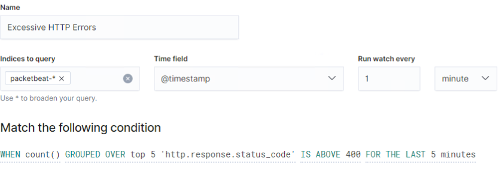
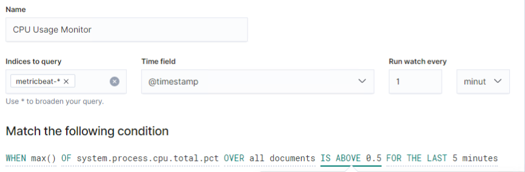
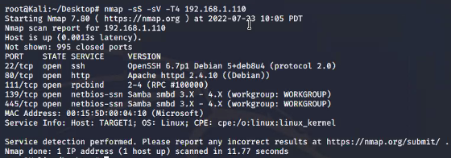

#Final Project 

Network Toplogy

# Blue Team: Summary of Operations

Table of Contents

Network Topology
Description of Targets
Monitoring the Targets
Patterns of Traffic & Behavior
Suggestions for Going Further

Network Topology
The following machines were identified on the network:

### Name of VM 1
`Kali`

Operating System:
`Linux`

Purpose:
`Attack Machine`

IP Address:
`192.168.1.90`

### Name of VM 2
`Capstone`

Operating System:
`Linux`

Purpose:
`Test Machine`

IP Address:
`192.168.1.105`

Etc.

Description of Targets
Answer the questions below.
The target of this attack was: Target 1 (`192.168.1.110`).
Target 1 is an Apache web server and has SSH enabled, so ports 80 and 22 are possible ports of entry for attackers. As such, the following alerts have been implemented:

Thresholds Set

### Monitoring the Targets
Traffic to these services should be carefully monitored. To this end, we have implemented the alerts below:

Alert 1: `HTTP Request Size Monitor` is implemented as follows:

Metric: `All HTTP documents`

Threshold: `3500 requests per 1 minutes `

Vulnerability Mitigated: `Repeat request byte sizes, mitigating scans that happen quicker that human capabilities to reduce risk of sensitive data exposure.`

Reliability: `Low; Possibility for false positives/false negatives. This threshold is low and would alert very often.`

Alert 2: `Excessive HTTP Errors`is implemented as follows:

Metric: `http.response.status_code`

Threshold: `400 errors per 5 minutes`

Vulnerability Mitigated: ``

Reliability: TODO: Does this alert generate lots of false positives/false negatives? Rate as low, medium, or high reliability.

Name of Alert 3
Alert 3 is implemented as follows:

Metric: TODO

Threshold: TODO

Vulnerability Mitigated: TODO

Reliability: TODO: Does this alert generate lots of false positives/false negatives? Rate as low, medium, or high reliability.

TODO Note: Explain at least 3 alerts. Add more if time allows.

Suggestions for Going Further (Optional)
TODO:

Each alert above pertains to a specific vulnerability/exploit. Recall that alerts only detect malicious behavior, but do not stop it. For each vulnerability/exploit identified by the alerts above, suggest a patch. E.g., implementing a blocklist is an effective tactic against brute-force attacks. It is not necessary to explain how to implement each patch.

The logs and alerts generated during the assessment suggest that this network is susceptible to several active threats, identified by the alerts above. In addition to watching for occurrences of such threats, the network should be hardened against them. The Blue Team suggests that IT implement the fixes below to protect the network:

Vulnerability 1

Patch: TODO: E.g., install special-security-package with apt-get

Why It Works: TODO: E.g., special-security-package scans the system for viruses every day

Vulnerability 2

Patch: TODO: E.g., install special-security-package with apt-get

Why It Works: TODO: E.g., special-security-package scans the system for viruses every day

Vulnerability 3

Patch: TODO: E.g., install special-security-package with apt-get

Why It Works: TODO: E.g., special-security-package scans the system for viruses every day

# Red Team: Summary of Operations

Table of Contents

Exposed Services
Critical Vulnerabilities
Exploitation

Exposed Services
TODO: Fill out the information below.
Nmap scan results for each machine reveal the below services and OS details:

$ nmap -sS -sV -T4 192.168.1.110 

This scan identifies the services below as potential points of entry:

Target 1
| Port   | Open Service   | Version   |
| ------ | -------------- | --------- |
| 22/tcp | ssh            | OpenSSH 6.7p1 Debian 5+deb8u4 |
| 80/tcp | http           | Apache httpd 2.4.10 ((Debian)) |  

Fill out the list below. Include severity, and CVE numbers, if possible.
The following vulnerabilities were identified on each target:

Target 1

List of
Critical
Vulnerabilities
Critical Vulnerabilities: Target 1

Our assessment uncovered the following critical vulnerabilities in Target 1.

 Vulnerability
Description
Impact
- Security 
Misconfiguration
Nmap was used to discover open ports, and wpscan was used to find users in the system
Ability to discover open ports and usernames gives attacker free reign to tailor specific attacks
- Cryptographic Failures
There was a file on the system that contained the login information for the mysql database in clear text
Not only was the database accessed, but important files were able to be downloaded using the provided password.
- Identification and Authentication Failures
A user was using a weak password which was able to be easily obtained through guessing
Correctly guessed password gave the threat actor the ability to ssh into the system.
- Broken Access Control
When configuring Steven’s account, the principle of least privilege was not implemented correctly.
Threat actor was able to perform privilege escalation with sudo python command. 

Exploitation
Fill out the details below. Include screenshots where possible.
### Nmap Scan Results

 

### Wordpress

Accessed mySQL database for RavenSecurity.

Located username, password and hostname from the database.

Found users and their password hashes.

Michael and Steven's hashes were able cracked!

The Red Team was able to penetrate Target 1 and retrieve the following confidential data:

Target 1

flag1.txt:

Exploit Used

User has read priviledges to the /var/www/html directory. If we assume the flag is sensitive data, the file should have stricture rules. Or user should not have access to root. 
Command: cat service.html | grep flag1

flag2.txt:

Exploit Used

User has read priviledges to the /var/www directory. If we assume the flag is sensitive data, the file should have stricture rules. Or user should not have access to root. 
Command: cd /var/www | cat flag2.txt

flag4.txt:

Exploit Used

User was able to achieve root access. This data was saved to root's home directory. 

## Network Analysis
Time Thieves
At least two users on the network have been wasting time on YouTube. Usually, IT wouldn't pay much mind to this behavior, but it seems these people have created their own web server on the corporate network. So far, Security knows the following about these time thieves:
They have set up an Active Directory network.
They are constantly watching videos on YouTube.
Their IP addresses are somewhere in the range 10.6.12.0/24.
You must inspect your traffic capture to answer the following questions:
What is the domain name of the users' custom site?
 
What is the IP address of the Domain Controller (DC) of the AD network?
 
What is the name of the malware downloaded to the 10.6.12.203 machine? Once you have found the file, export it to your Kali machine's desktop.
 
Upload the file to VirusTotal.com. What kind of malware is this classified as?
 
 
 
Vulnerable Windows Machines
The Security team received reports of an infected Windows host on the network. They know the following:
Machines in the network live in the range 172.16.4.0/24.
The domain mind-hammer.net is associated with the infected computer.
The DC for this network lives at 172.16.4.4 and is named Mind-Hammer-DC.
The network has standard gateway and broadcast addresses.
Inspect your traffic to answer the following questions:
Find the following information about the infected Windows machine:
Host name:
IP address:
MAC address:

What is the username of the Windows user whose computer is infected?
 
What are the IP addresses used in the actual infection traffic?
 
As a bonus, retrieve the desktop background of the Windows host.
 
