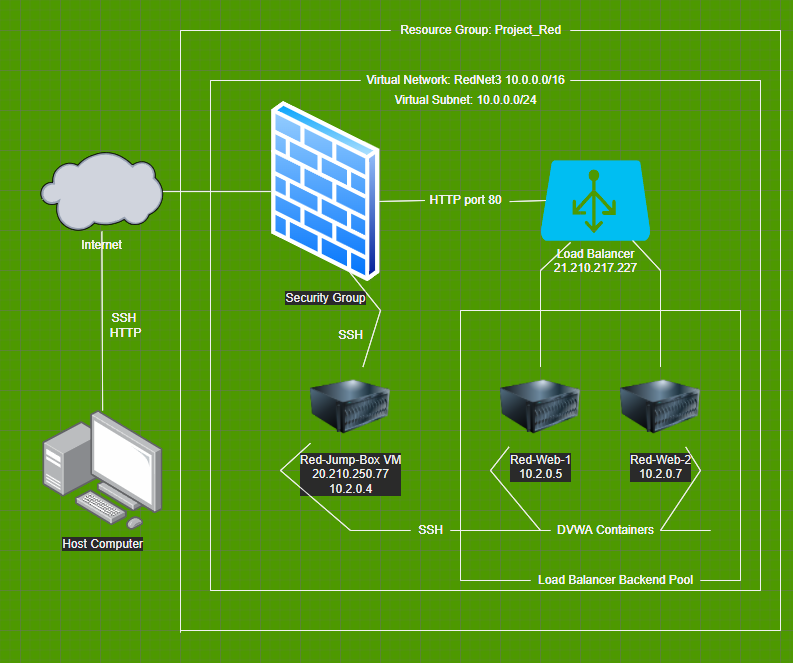

### Azure Cloud Lab

This repository is a lab overview of my Azure Cloud Project created for Michigan State Cybersecurity Bootcamp. In this lab, I created an ELK stack, Elastic Logstash and Kibana, and the DVWA, Damn Vulnerable Web Application within docker containers that were built out inside of an Ansible container. 

### Contents
----

- Azure
- Docker
- Ansible

## Project Diagram 

The diagram below is a map of the Azure environment I have created, detailing the virtual machines and protocols used to access them. It also shows notes the DVWA image is being used within an Ansible container. 

## Ansible

## Linux

