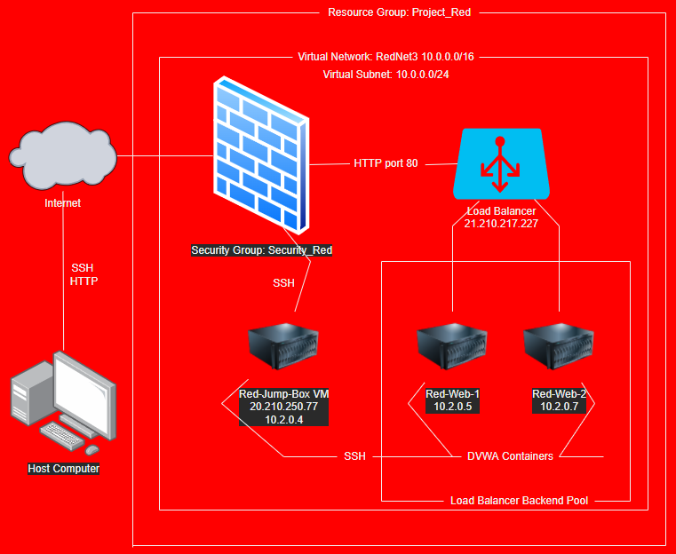
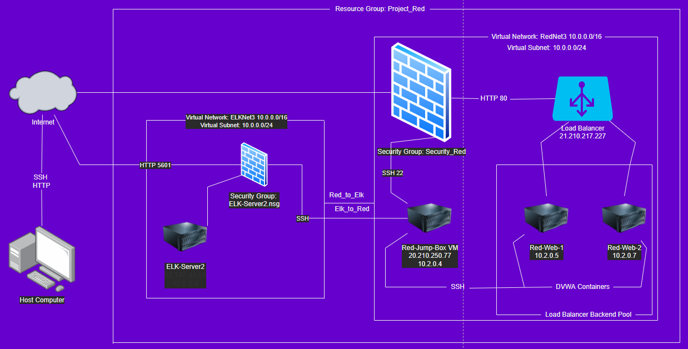

# Azure Cloud Lab

This repository is a lab overview of my Azure Cloud Project created for Michigan State Cybersecurity Bootcamp. In this lab, I created an ELK stack, Elastic Logstash and Kibana, and the DVWA, Damn Vulnerable Web Application within docker containers that were built out inside of an Ansible container. 

### Contents
----
- Project Diagram
- Docker
- Ansible

## Project Diagram 

The diagram below is a map of the Azure environment I have created, detailing the virtual machines and protocols used to access them. It also notes the DVWA image is being used within an Ansible container. 



The diagram below maps the additions of the ELK_Net2 peering to the RedNet3. 



## Docker
    + Commands to install docker onto system, pull an ansible image, and interact with docker containers created
```bash
#install docker
sudo apt install docker.io

#make sure docker is running
sudo systemctl status docker

#pull the latest image for a container
sudo docker pull cyberxsecurity/ansible:latest

#to create the container;
#-t start, -i interact
sudo docker run -ti cyberxsecurity/ansible:latest

#list all created containers
#-a all
sudo docker container list -a

#remove any extra containers 
sudo docker rm <container id>

#start and interact with the desired container: 
sudo docker start -ai <container id>

#To ensure ansible is able to connect to VMs 
ansible -m ping --all

# run a container inside of a running container with a bash session
sudo docker exec -it <container name> bash

#Within Container, SSH to web servers created in Azure using server log in and ip
ssh username@privateip

#To run a playbook in ansible
nano file_name
ansible-playbook file_name

#or try this to run the playbook
ansible-playbook --key-file ~/.ssh/private_key file.yml
```
## Ansible

Here you will find the scripts to set up Filebeat along with , Metricbeat, and install ELK and the DVWA image along with the updated host configuration and ansible configuration files.

### Installing Docker
   + `pentest.yml`

        + This playbook is to install Docker, Python, Pip3, and DVWA to the 2 webservers.
```yml
---
#Install Docker, Python, Pip3, and DVWA to Web Servers
- name: Config Web VM with Docker
  hosts: webservers
  become: true
  tasks:
#Install docker.io 
  - name: Install docker.io     
    apt: 
      update_cache: yes         
      name: docker.io
      state: present
#Install pip3
  - name: Install pip3
    apt: 
      name: python3-pip
      state: present
#Install Docker Python Module using pip3
  - name: Install Docker python module
    pip:
      name: docker
      state: present
#Install Docker Web Container cyberxsecurity/dvwa Image and Start container and map port 
  - name: Download and Launch a Docker Web Container
    docker_container:
      name: dvwa
      image: cyberxsecurity/dvwa
      restart_policy: always
      published_ports: 80:80
#Start Docker Service on system boot
  - name: Enable Docker Service
    systemd:
      name: docker
      enabled: yes
```
### Installing Elk
   + `install-elk.yml`

        + This playbook is to install Docker, Python, Pip3, and sebp/elk:761 Image to the ELK server.
```yml
---
#Install Docker, Python, Pip3, and sebp/elk:761 image to ELK Server
- name: Config Elk VM with Docker
  hosts: elk
  become: true
  tasks:
  - name: Use more memory
    sysctl:
      name: vm.max_map_count
      value: '262144'
      state: present
      reload: yes
#Install docker.io
  - name: docker.io
    apt:
      update_cache: yes
      name: docker.io
      state: present
#Install pip3
  - name: Install pip3
    apt:
      name: python3-pip
      state: present
#Install Docker Python Pip Module
  - name: Install Docker Python Module
    pip:
      name: docker
      state: present
#Install Docker web container sebp/elk:761 Image, start the container, and map ports
  - name: Download and Launch a Docker Elk Container
    docker_container:
      name: elk
      image: sebp/elk:761
      state: started
      restart_policy: always
      published_ports:
        - 5601:5601
        - 9200:9200
        - 5044:5044
#Start Docker service on system boot
  - name: Enable Docker Service
    systemd:
      name: docker
      enabled: yes
```
### Updating hosts file
   + `host.cfg`

        + Adding the private ips for the web servers within the webservers hosts group. Similarly, adding the private ip for the elk server within the elk host group.

```conf
[webservers]
10.2.0.5 ansible_python_interpreter=/usr/bin/python3    
10.2.0.7 ansible_python_interpreter=/usr/bin/python3    

[elk]
10.0.0.4 ansible_python_interpreter=/usr/bin/python3   
```

### Updating ansible file
   + `ansible.cfg`

        + Updating the remote user to the username for the web servers.

```conf
remote_user = name
```
### Update Filebeat configurations
   + `filebeat-config.yml`

        + Updating the hosts to reflect the ELK private ip to display Elasticsearch and Kibana
```conf
#-------------------------- Elasticsearch output -------------------------------
output.elasticsearch:
  # Boolean flag to enable or disable the output module.
  #enabled: true

  # Array of hosts to connect to.
  # Scheme and port can be left out and will be set to the default (http and 9200)
  # In case you specify and additional path, the scheme is required: http://localhost:9200/path
  # IPv6 addresses should always be defined as: https://[2001:db8::1]:9200
  hosts: ["10.0.0.4:9200"]
  username: "elastic"
  password: "changeme" 
```
```conf
#============================== Kibana =====================================

# Starting with Beats version 6.0.0, the dashboards are loaded via the Kibana API.
# This requires a Kibana endpoint configuration.
setup.kibana:
  host: "10.0.0.4:5601" 
```

### Installing Filebeat
   + `filebeat-playbook.yml`
```yml
---
#Install, enable and setup FileBeat modules on boot
- name: Installing and Launching Filebeat
  hosts: webservers
  become: yes
  tasks:
#Downloading Filebeat via url 
  - name: Download Filebeat
    command: curl -L -O https://artifacts.elastic.co/downloads/beats/filebeat/filebeat-7.6.1-amd64.deb
#Depakaging and Installing Filebeat
- name: Install Filebeat
    command: dpkg -i filebeat-7.6.1-amd64.deb
#Mapping where to drop the Filebeat files
- name: Drop in filebeat.yml
    copy:
      src: /etc/ansible/files/filebeat-config.yml
      dest: /etc/filebeat/filebeat.yml
#Enable Filebeat Modules
  - name: Enable and Configure System Module
    command: filebeat modules enable system
#Setup Filebeat
  - name: Setup Filebeat
    command: filebeat setup
#Start service
  - name: Start Filebeat service
    command: service filebeat start
#Start Filebeat on system boot
  - name: Enable Service Filebeat on Boot
    systemd:
      name: filebeat
      enabled: true
```

### Updating Metricbeat Configurations
   + `metricbeat-config.yml`

        + Updating the hosts to reflect the ELK private ip to display Elasticsearch and Kibana

```conf
#============================== Kibana =====================================

# Starting with Beats version 6.0.0, the dashboards are 
loaded via the Kibana API.
# This requires a Kibana endpoint configuration.        
setup.kibana:
  host: "10.0.0.4:5601"
```
```conf
#================================ Outputs =====================================

# Configure what output to use when sending the data collected by the beat.

#-------------------------- Elasticsearch output ------------------------------
output.elasticsearch:
  # Array of hosts to connect to.
  hosts: ["10.0.0.4:9200"]
  username: "elastic"
  password: "changeme"
  ```

### Installing Metricbeat
   + `metricbeat-playbook.yml`

```yml
---
- name: Install Metricbeat
  hosts: webservers
  become: true
  tasks:
#Downloading Metricbeat via url
  - name: Download Metricbeat
    command: curl -L -O https://artifacts.elastic.co/downloads/beats/metricbeat/metricbeat-7.6.1-amd64.deb
#Depakaing and installing Metricbeat
  - name: Install Metricbeat
    command: dpkg -i metricbeat-7.6.1-amd64.deb
#Mapping where to drop metricbeat files within ansible container
  - name: Drop Metricbeat Config
    copy:
      src: /etc/ansible/files/metricbeat-config.yml
      dest: /etc/metricbeat/metricbeat.yml
#Enable Metricbeat Modules
  - name: Enable and configure docker module for Metricbeat
    command: metricbeat modules enable docker
#Setup Metricbeat
  - name: Setup Metricbeat
    command: metricbeat setup
#Start service
  - name: Start Metricbeat
    command: service metricbeat start
#Start Metricbeat on system boot
  - name: Enable Service Metricbeat on Startup
    systemd:
      name: metricbeat
      enabled: true
```


